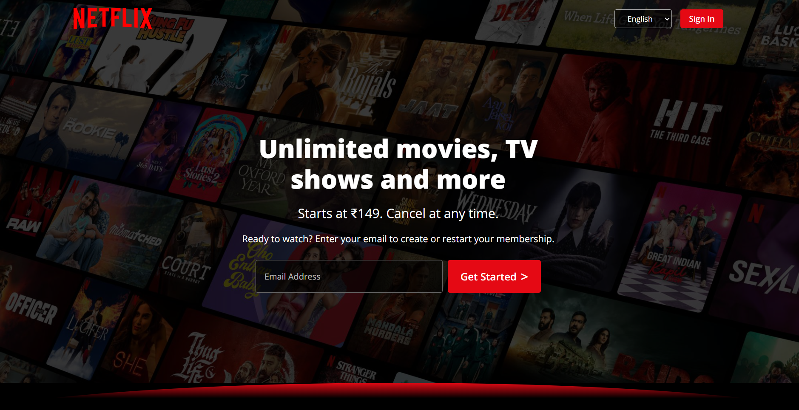

# 🎬 Netflix Clone (Homepage)

A responsive **Netflix Homepage Clone** built using **HTML & CSS**.  
This project replicates the main landing page of Netflix with clean UI, carousel animations, and modern design.

---

## 🚀 Features
- 🎥 **Hero Section** – Large background image with signup form.
- 🔄 **Infinite Scrolling Carousel** – Trending shows auto-scroll with hover pause.
- 📱 **Responsive Layout** – Adjusts for desktop, tablet, and mobile screens.
- ✨ **Hover Effects** – Smooth hover animations on cards.
- 📌 **Reasons-to-Join Cards** – Interactive cards with hover effects.
- ❓ **FAQ Section** – Accordion-style FAQ design.
- 🏷️ **Footer Section** – Responsive footer with links and language selector.

---

## 📸 Demo Preview
  

*(Replace with your screenshot of the project in `Assets/demo.png`)*

---

## 🛠️ Built With
- **HTML5**
- **CSS3 (Flexbox, Grid, Animations)**

---

## 📂 How to Run
1. Clone this repo:
   ```bash
   git clone https://github.com/YourUsername/Netflix-Clone.git
